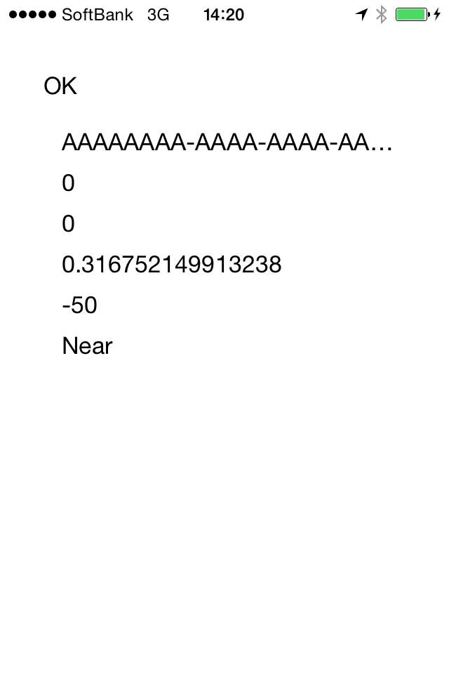

# iBeaconDemo

This is iOS iBeacon Sample Project in Swift Language.

## Usage

git clone git@github.com:oggata/iBeaconDemo.git

## ToDo's

- Change some images by beacon proximity.
- Suggestions, issues and pull requests are more than welcome.

## Document
Qiita
http://qiita.com/oggata/items/5de43d71692d1abcff7c

## Contact

Fumitoshi Ogata
- [twitter.com/oggata](http://twitter.com/oggata)
- oggata@gmail.com

## License
iBeaconDemo is available under the MIT license. 
See the LICENSE file for more info.
